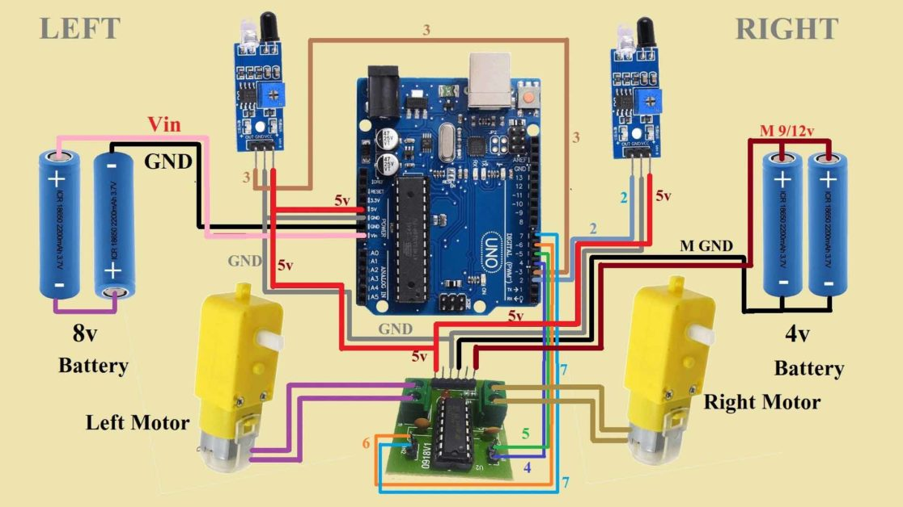
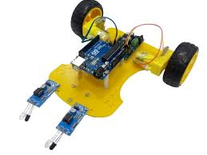

# Line Following Robot
## Table of Contents
- Introduction
- Components
- Circuit Diagram
- Logic Explanation
- Conclusion
## 1. Introduction
A line following robot is an autonomous machine that detects and follows a line drawn on the floor. The line can be black on a white surface or white on a black surface. This type of robot is commonly used in robotic competitions and educational projects to teach the basics of robotics and control systems.

## 2. Components
### Microcontroller: 
Arduino (e.g., Arduino Uno,any board)
**Sensors:** 3 IR sensors  
Sensor_L (Left sensor) connected to digital pin 5  
Sensor_C (Center sensor) connected to digital pin 6  
Sensor_R (Right sensor) connected to digital pin 7  
**Motors:** 2 DC motors controlled via motor driver  
Left motor forward pin (L_motorF) connected to digital pin 8
Left motor backward pin (L_motorB) connected to digital pin 9
Left motor PWM pin (L_motorP) connected to digital pin 3
Right motor forward pin (R_motorF) connected to digital pin 11
Right motor backward pin (R_motorB) connected to digital pin 12
Right motor PWM pin (R_motorP) connected to digital pin 5

## 3. Circuit Diagram
The circuit diagram connects the microcontroller, sensors, motor driver, and motors. Here is a brief description of the connections:
**IR Sensors:** Connect the output pins to the analog or digital input pins on the Arduino.
**Motor Driver:** Connect the input pins to digital output pins on the Arduino and the motor terminals to the DC motors.
**Power Supply:** Ensure the motors and motor driver have an adequate power supply, usually a battery pack.  

## 4. Logic Explanation
The robot's movement is determined by the sensor readings:

- All sensors on the line (LS==1, CS==1, RS==1): Move forward.  
- Left and center sensors on the line (LS==1, CS==1, RS==0): Turn left.  
- Only left sensor on the line (LS==1, CS==0, RS==0): Turn left.  
- Center and right sensors on the line (LS==0, CS==1, RS==1): Turn right.  
- Only center sensor on the line (LS==0, CS==1, RS==0): Move forward.  
- Only right sensor on the line (LS==0, CS==0, RS==1): Turn right.  
- No sensors on the line (LS==0, CS==0, RS==0): Stop.  

## Conclusion
Line following robots are versatile and valuable tools across various domains. Their ability to follow predefined paths with precision makes them ideal for automation, education, healthcare, agriculture, research, and security. As technology advances, the applications of line-following robots continue to expand, contributing to increased efficiency, safety, and innovation in multiple fields.

